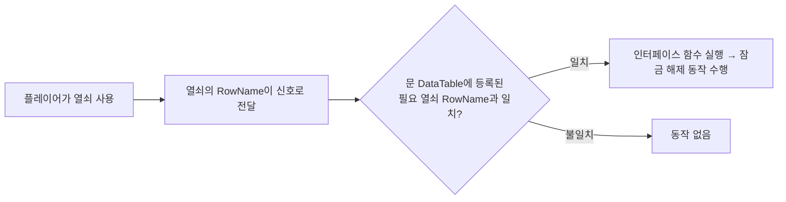

# Project_EscapeRoom

Unreal Engine 5.7 / Blueprint로 제작한 방탈출(Escape Room) 시뮬레이션 프로젝트입니다.
모든 로직은 블루프린트로 구현했으며, 콘텐츠 확장성을 고려해 **DataTable 기반 데이터드리븐 설계**로 인터랙션 오브젝트를 관리했습니다.

- **엔진**: Unreal Engine 5.7
- **개발 방식**: Blueprint Only
- **레포**: https://github.com/ksj000503/Project_EscapeRoom

---

## 🧩 핵심 설계: 데이터드리븐 인터랙션 시스템

이 프로젝트의 핵심은 문, 열쇠 등 모든 인터랙션 오브젝트를 **하나의 공통 DataTable 구조**로 관리한 점입니다.
오브젝트 종류별로 블루프린트 로직을 새로 짜지 않고, DataTable의 RowName만 교체해서 동작을 바꿀 수 있도록 설계했습니다.

**DataTable 공통 필드**
- `Name`, `Mesh` — 모든 오브젝트(문, 열쇠 등)가 공유하는 기본 정보

**오브젝트별 데이터**
- **문**: 잠금해제 방식, 잠금해제에 필요한 열쇠의 RowName
- **열쇠**: 자기 자신의 RowName이 곧 식별값

**동작 흐름**

이 구조의 장점은, 새로운 문/열쇠 조합을 추가하거나 기존 오브젝트의 동작을 바꿀 때 **블루프린트 그래프를 수정하지 않고 DataTable 값만 변경하면 된다는 점**입니다. 콘텐츠 추가와 유지보수가 쉬운 구조를 목표로 설계했습니다.

---

## 🎒 인벤토리 시스템

- **드래그 앤 드랍**: 인벤토리 슬롯 간 아이템을 자유롭게 이동
- **퀵 인벤토리**: 자주 쓰는 아이템을 선택해 바로 사용 가능한 슬롯 제공

---

## 🛠 실행 방법

1. Unreal Engine 5.7 설치
2. `Project_EscapeRoom.uproject` 실행
3. 메인 레벨에서 플레이

---

